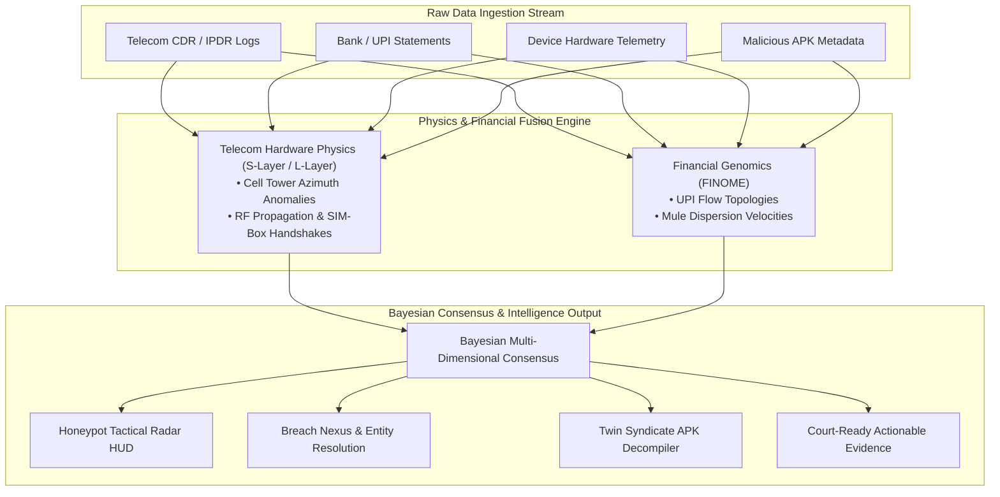

<div align="center">
  <br />
  <h1 align="center">
    
    <br />
    ARGUS (DFAP)
  </h1>
  <p align="center">
    <b>Physics-Grounded Intelligence Platform for SIM-Box, Mule Network Detection & Cross-Domain Cyber Fraud Analytics</b>
  </p>
  <p align="center">
    <i>Chandigarh Police Hackathon 2026 — Track 6 Submission</i>
  </p>
  <p align="center">
    
    
    
    
    
    
    
  </p>
  <br />
</div>

---

## Executive Overview

**ARGUS (Digital Forensics & Analytics Platform - DFAP)** is an advanced, physics-grounded cyber intelligence platform engineered for law enforcement agencies and telecom security analysts. By unifying **Telecom Telemetry (CDR/IPDR)**, **Financial Genomics (Bank/UPI Statements)**, and **Cross-Domain Threat Intelligence**, ARGUS resolves coordinated fraud syndicates, illegal SIM-box operations, and money-mule networks into court-ready actionable evidence.

Traditional detection engines look at isolated behavioral signals which cyber-syndicates easily spoof. ARGUS introduces a **Multi-Dimensional Reality Consensus Model**: verifying physical hardware signals (RF propagation, cell tower handshakes, IMEI physical anomalies) against logical transaction flows (UPI velocity, fan-out ratios, temporal dispersion).

---

## Key Architecture & Highlights

### 1. Carrier-Grade 12-Layer Fusion Pipeline



* **Raw Ingestion Engine**: Unifies heterogeneous data streams (CDR/IPDR logs, bank CSV/XLS, device telemetry, APK metadata).
* **Telecom Hardware Physics (S-Layers & L-Layers)**: Detects physical SIM-box clustering, VoIP bypass routing, cell tower azimuth anomalies, and suspicious device handshakes.
* **Financial Genomics (FINOME)**: Maps transactional DNA, UPI flow topologies, mule account dispersion velocities, and layered cash-out patterns.
* **Bayesian Consensus Engine**: Computes mathematical consistency across physical and financial domains to eliminate false positives.

---

### 2. Core Operational Modules

<table align="center" width="100%">
  <tr>
    <td width="50%" valign="top">
      <h4 align="center">Honeypot Tactical Radar HUD</h4>
      <p>Real-time national map visualization of telemetry feeds, cell tower signal strength, and live threat vectors across Indian states.</p>
    </td>
    <td width="50%" valign="top">
      <h4 align="center">Deception Genome & Tower Heatmap</h4>
      <p>Interactive geographic density mapping for illegal SIM-box arrays and localized signal triangulation.</p>
    </td>
  </tr>
  <tr>
    <td width="50%" valign="top">
      <h4 align="center">Breach Nexus & Entity Resolution</h4>
      <p>Interactive graph matching linking IMEIs, IMSIs, bank accounts, UPI IDs, and physical addresses into unified suspect clusters.</p>
    </td>
    <td width="50%" valign="top">
      <h4 align="center">Twin Syndicate (APK Lab)</h4>
      <p>Malicious Android package decompiler and behavior scanner powered by Google Gemini AI for malware analysis.</p>
    </td>
  </tr>
</table>

---

## Tech Stack

<p align="left">
  
  
  
  
</p>

---

## Getting Started

### Prerequisites
* **Node.js**: v18.x or higher
* **npm**: v9.x or higher

### Installation & Local Setup

1. **Clone the Repository**
   ```bash
   git clone https://github.com/gurarpitzz/Argus-Hack-CP.git
   cd Argus-Hack-CP
   ```

2. **Install Dependencies**
   ```bash
   npm install
   ```

3. **Configure Environment Variables**
   Create a `.env` or `.env.local` file in the root directory:
   ```env
   GEMINI_API_KEY=your_gemini_api_key_here
   ```

4. **Launch the Development Server**
   ```bash
   npm run dev
   ```
   Open [http://localhost:3000](http://localhost:3000) (or the port displayed in your terminal) to view ARGUS in action.

5. **Build for Production**
   ```bash
   npm run build
   npm start
   ```

---

## Project Structure

```
remix-argus/
├── src/
│   ├── components/            # UI components (Radar HUD, Entity Resolution, APK Lab, etc.)
│   ├── lib/
│   │   ├── aetherEngine.ts    # Synthetic telemetry, risk scoring & stream state engine
│   │   └── gemini.ts          # Gemini AI integration for APK analysis & threat insights
│   ├── App.tsx                # Master dashboard entry point & view switcher
│   └── index.css              # Global design system, glassmorphism & HUD styling
├── server.ts                  # Express server entry point
├── generate_datasets.py       # Data generation script for synthetic CDR/Bank telemetry
├── system_telemetry.csv       # Sample system telemetry dataset
├── attacker_logs.csv          # Sample honeypot attack logs
└── deception_responses.csv   # Dynamic deception engine responses
```

---
